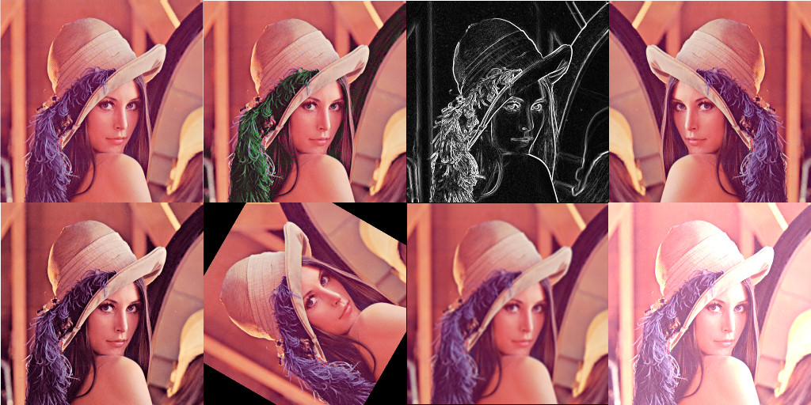

# Basic Image Manipulation

This article is intended for people curious to know how to do some simple image manipulations such as rotation, colorization, increase of contrast, blur, edge detection...

In this playground, you will practice simple image manipulations, without the help of advanced libraries. The code that is provided isn't optimized, this is just for educational purpose, I recommend using a software or a library if you have to do image manipulations.

The source codes are done in Python but if you know how to program in another language, you should be able to understand the codes. The code can be executed directly in your browser.

Table of Content:

- [Crop, Flip, Rotate and Resize](transform.md)
- [Luminosity, Contrast and Colorize](color.md)
- [Kernel filtering (edge detection, blur, ...)](edge.md)

Because of a lack of imagination, I decided to use the famous picture of [Lenna](https://en.wikipedia.org/wiki/Lenna), a standard test image widely used in the field of image processing. Feel free to recommend me other pictures that I can use to illustrate the various transformations and filters.


```math
\text{A preview of the image manipulations tackled in this playground}
```
